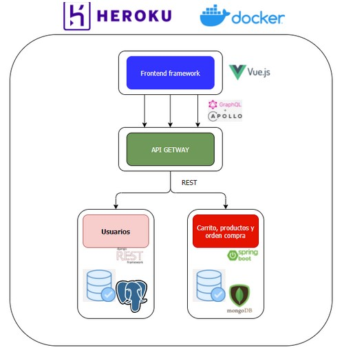

# Proyecto final Ciclo IV - Mision Tic 2022

# Descripción del Proyecto:

Creación de una aplicativo web para venta de mercancía Gaming en general (juegos, hardware, periféricos, muebles, etc.)

# Problema a Atacar:

Necesidad de una aplicación web que permita la gestión de ventas de productos Gaming.

# Producto Mínimo Viable (MVP):

Como producto mínimo viable se define una aplicación web que permita la creación de usuarios con los que se logrará acceder a la misma para realizar las respectivas compras.
La aplicación contará con una página de inicio en donde podrá consultar los productos disponibles a ofrecer, y desde allí se podrá agregar elementos a un carrito de compras.
Desde el carrito de compras se podrá consultar los productos que los componen, así como el valor total de éstos. Adicionalmente, se podrá generar la orden de compra.
La orden de compra podrá ser confirmada o eliminada, y al confirmarse se simula el proceso de compra reduciendo la cantidad de inventario de los productos adquiridos.

# Arquitectura 

# Link:
https://gameloadv1.herokuapp.com/
